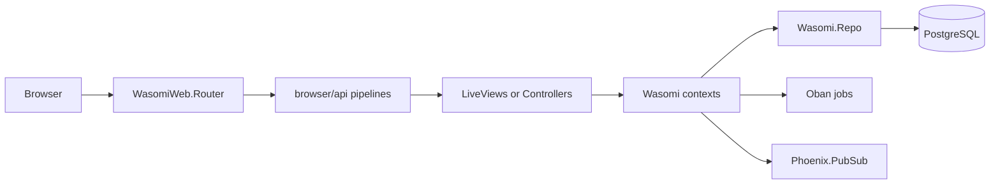

# Architecture

Wasomi is a Phoenix 1.7 application named `:wasomi`. The web layer lives in `lib/wasomi_web`, business logic lives in context modules under `lib/wasomi`, and persistence flows through `Wasomi.Repo` into PostgreSQL.

## Request Flow

The browser pipeline fetches sessions, flash, CSRF protection, secure headers, and `current_user`. LiveView scopes use `WasomiWeb.UserAuth` `on_mount` hooks to mount, require, redirect, or require admin users.

## Directory Map

`lib/wasomi/`

- `accounts.ex`, `accounts/` - user registration, sessions, roles, email confirmation, password reset.
- `catalog.ex`, `catalog/` - courses, modules, lectures, pricing, public catalog ordering, admin content CRUD.
- `enrollments.ex`, `enrollments/` - pending and active course access.
- `payments.ex`, `payments/`, `paystack.ex` - checkout, Paystack verification, revenue reporting, payment workers.
- `learning.ex`, `learning/` - lecture progress, course completion, unlock rules.
- `certificates.ex`, `certificates/` - module/course certificate issue jobs, PDF rendering boundary, storage boundary.
- `media.ex`, `media/` - protected lecture playback and admin upload boundary.
- `notifications.ex`, `notifications/` - transactional email entry points and workers.
- `application.ex`, `repo.ex`, `mailer.ex` - OTP supervision, Ecto repo, mailer.

`lib/wasomi_web/`

- `router.ex` - scopes, pipelines, LiveView sessions, and webhooks.
- `user_auth.ex` - plugs and LiveView hooks for authentication and admin authorization.
- `live/` - public catalog, learner portal, admin portal, auth screens, generated CRUD screens.
- `controllers/` - session, media playback, certificate download, Paystack callback/webhook, static page.
- `components/` - shared core, home, student, admin, and layout components.

## Tech Stack

- Phoenix, Phoenix LiveView, Phoenix HTML, Bandit - HTTP and interactive UI.
- Ecto SQL, Postgrex - database access.
- Oban - background jobs for payments and certificates.
- Bcrypt - password hashing.
- Swoosh and Finch - email delivery.
- Money - currency-safe formatting from minor units.
- Req - Paystack HTTP client.
- ExAws, ExAws S3, Hackney, SweetXml - Cloudflare R2/S3-compatible certificate storage.
- Esbuild, Tailwind, Heroicons - asset pipeline and UI icons.
- Mox, Floki, Credo - test doubles, HTML assertions, static analysis.

## LiveView and Real Time

Most UI screens are LiveViews. Learner progress and payment completion use Phoenix PubSub topics keyed by user id so the course player and checkout surfaces can react to state changes. Oban workers reconcile stale Paystack payments and issue certificates after learning completion events.
