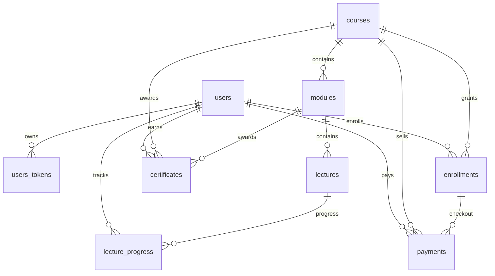

# Data Model

The database is PostgreSQL through `Wasomi.Repo`. Migrations live in `priv/repo/migrations`.

## Tables

`users`

- Identity and roles: `name`, `email`, optional `phone`, `hashed_password`, `confirmed_at`, `role`.
- Unique indexes on `email` and `phone`.
- Role constraint allows `learner` and `admin`.

`users_tokens`

- Session, confirmation, email-change, and reset-password tokens.
- Belongs to `users` with `on_delete: :delete_all`.

`courses`

- `slug`, `title`, `subtitle`, `description`, `thumbnail_key`, `price_minor`, `currency`, `status`, `position`.
- Unique `slug`; status is `draft` or `published`.

`modules`

- Course sections with `title`, `description`, `position`, `course_id`.
- Unique `course_id, position`; deleting a course deletes modules.

`lectures`

- Lessons with `title`, `description`, `video_provider`, `video_asset_id`, `duration_seconds`, `position`, `module_id`.
- Video provider must be `mux`, `cloudflare`, or `bunny`; deleting a module deletes lectures.

`enrollments`

- User/course access with `status`, `enrolled_at`, and `activated_at`.
- Unique `user_id, course_id`.
- `pending` enrollments must not have `activated_at`; `active` enrollments must have it.

`payments`

- Provider transactions with `provider`, `provider_reference`, `amount_minor`, `currency`, optional `phone`, `status`, `raw_payload`, `paid_at`, and foreign keys to user, course, and enrollment.
- Provider reference is unique. Successful payments require `paid_at`; other statuses must not have it.

`lecture_progress`

- Per-user lecture state with `status`, `last_position_seconds`, and `completed_at`.
- Unique `user_id, lecture_id`.

`certificates`

- Learner certificates with `type`, `serial_number`, `file_key`, `issued_at`, `user_id`, `course_id`, and optional `module_id`.
- `module` certificates require `module_id`; `course` certificates require `module_id` to be null.
- Partial unique indexes prevent duplicate module/course certificates for a user.

`oban_jobs`

- Managed by Oban migrations, used for payment reconciliation and certificate issuing jobs.
