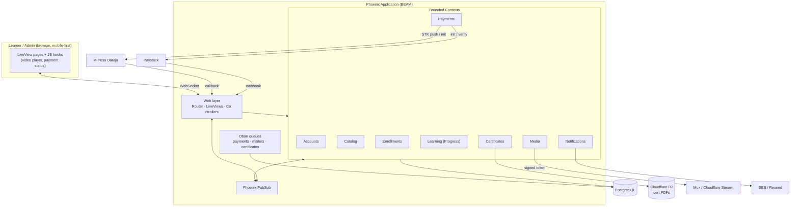
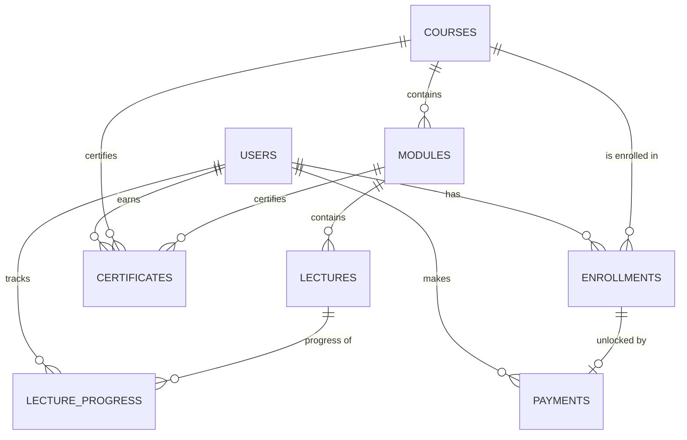
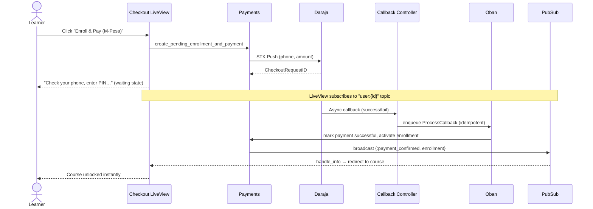

# Wasomi Business Institute — E-Learning Platform

## Architecture & Technical Design (`project.md`)

**Stack:** Elixir / Phoenix / LiveView · PostgreSQL · Oban · Tailwind
**Status:** v1 — Proof of Concept (per brief v1.0, 21 June 2026)
**Audience:** Engineering team building the first iteration

---

## 1. Overview & Goals

Wasomi Business Institute needs a website that doubles as a paid, video-based
e-learning platform. A learner must be able to **register → pay → watch
protected video lectures → track progress → receive certificates**, entirely
online. The first course loaded is _"The Human Stack: Communication and
Presentation Skills for Technology Professionals"_ (6 modules).

This is explicitly a **first iteration / proof of concept**. The brief asks us
to favour a _clean, reliable, functional_ build over elaborate features, while
keeping the architecture _reasonably extensible_. Throughout this document,
**`FUTURE`** callouts mark places where we deliberately pick the faster v1
option and note what to revisit later — as the brief requests in §6.

### Why Phoenix LiveView for this product

| Requirement                                    | How the BEAM/LiveView stack earns its place                                                                                           |
| ---------------------------------------------- | ------------------------------------------------------------------------------------------------------------------------------------- |
| Real-time payment unlock (M-Pesa STK is async) | `Phoenix.PubSub` + LiveView updates the learner's screen the instant the payment callback lands — no client polling, no page refresh. |
| Reliable async work (callbacks, certs, emails) | `Oban` gives durable, idempotent, retryable background jobs on top of Postgres — no extra infra.                                      |
| Concurrent webhook + STK callback handling     | The BEAM handles many concurrent provider callbacks trivially.                                                                        |
| Small team, ship fast                          | One app, one database, server-rendered UI, minimal custom JS. Low operational surface for a POC.                                      |
| Mobile-heavy audience                          | LiveView + Tailwind ships fast, mobile-responsive pages with small payloads.                                                          |

---

## 2. Guiding Principles

1. **Pay-gate is the core invariant.** No lecture content (or playback token)
   is ever served to a user without an **active, paid enrollment** for that
   course. This is enforced server-side, in the context layer, on every access
   — never only in the UI.
2. **Money and access are derived from verified provider events**, not from
   the client. We only activate access after we have independently confirmed
   payment with M-Pesa/Paystack.
3. **Idempotency everywhere payments touch.** Provider callbacks can be missed,
   duplicated, or replayed. Every payment mutation is keyed on the provider
   reference and safe to run twice.
4. **Provider boundaries are behaviours.** Video and payment providers sit
   behind Elixir behaviours so v2 can swap or add providers without touching
   domain logic.
5. **Honest content protection.** We implement reasonable, layered safeguards
   appropriate to a v1 platform and are explicit that no measure short of
   hardware DRM fully stops a determined screen-recorder.

---

## 3. Technology Stack

| Concern                           | Choice                                                                    | Rationale / Notes                                                                                                          |
| --------------------------------- | ------------------------------------------------------------------------- | -------------------------------------------------------------------------------------------------------------------------- |
| Language / framework              | **Elixir 1.17+, Phoenix 1.8, LiveView 1.0**                               | Real-time, fault-tolerant, low-JS.                                                                                         |
| Database                          | **PostgreSQL 16** (Ecto)                                                  | Single source of truth; also backs Oban.                                                                                   |
| Auth                              | **`phx.gen.auth`** (extended with `phone`)                                | Battle-tested email/password + confirmation, generated into our codebase (we own it).                                      |
| Background jobs                   | **Oban** (free tier)                                                      | Durable jobs for callbacks, certificates, emails, reconciliation.                                                          |
| Email                             | **Swoosh** + transactional provider (Resend / Amazon SES)                 | Swoosh ships with Phoenix; SES is cheap & deliverable from Africa.                                                         |
| Payments — mobile money           | **M-Pesa Daraja API** (STK Push)                                          | Primary payment rail for the Kenyan audience.                                                                              |
| Payments — card/regional          | **Paystack**                                                              | Cards + regional methods; we never touch raw card data (PCI offload).                                                      |
| Video hosting/streaming           | **Mux** or **Cloudflare Stream** (primary), **Bunny Stream** (budget alt) | HLS adaptive streaming + signed/expiring playback tokens. See §8. `FUTURE`: evaluate DRM tiers.                            |
| Object storage                    | **Cloudflare R2** (S3-compatible)                                         | Stores generated certificate PDFs & thumbnails. Zero egress fees.                                                          |
| PDF certificates                  | **ChromicPDF** (Heex → PDF)                                               | Render branded HTML/Tailwind templates to PDF. `FUTURE`/alt: Typst if we want to avoid the Chrome dependency in the image. |
| Money math                        | **`money` / `ex_money`**                                                  | Integer minor units, currency-aware formatting.                                                                            |
| Styling                           | **Tailwind CSS + esbuild** (Phoenix default)                              | Navy/orange brand system; mobile-first.                                                                                    |
| Admin CRUD (optional accelerator) | **Backpex** or custom LiveView                                            | Custom LiveView for learner-facing flows; Backpex can fast-track internal CRUD.                                            |
| Error tracking                    | **Sentry** (or AppSignal)                                                 | Plus `Phoenix.LiveDashboard` + Telemetry.                                                                                  |
| Hosting                           | **Fly.io** (region `jnb` — Johannesburg)                                  | Good Elixir support, low African latency. Alt: Hetzner/Dockerized release.                                                 |
| CI                                | **GitHub Actions**                                                        | format · credo · test · deploy.                                                                                            |

---

## 4. High-Level Architecture



---

## 5. Domain Model — Bounded Contexts

We model the system as Phoenix contexts. Each owns its schemas and exposes a
public API; cross-context calls go through that API, never directly into
another context's schemas.

> **Naming note:** "module" is an Elixir keyword concept. The course-structure
> schema is named **`CourseModule`** (table `modules`) to avoid colliding with
> `Module`. Worth getting right on day one.

| Context           | Responsibility                                                                                                                       | Key schemas                         |
| ----------------- | ------------------------------------------------------------------------------------------------------------------------------------ | ----------------------------------- |
| **Accounts**      | Identity, registration, login, confirmation, roles (`learner` / `admin`), phone capture & normalisation.                             | `User`, `UserToken`                 |
| **Catalog**       | Course structure & publishing. Courses → modules → lectures, ordering, pricing, thumbnails.                                          | `Course`, `CourseModule`, `Lecture` |
| **Enrollments**   | The pay-gate. One enrollment per (user, course); status `pending → active`. Single authority for "can this user access this course?" | `Enrollment`                        |
| **Payments**      | Provider integrations (M-Pesa, Paystack), payment lifecycle, idempotent callback handling, receipts, reconciliation.                 | `Payment`                           |
| **Learning**      | Per-lecture progress, completion detection at lecture/module/course level.                                                           | `LectureProgress`                   |
| **Certificates**  | Issue, render (PDF), store, and serve module- and course-level certificates with branding & serial numbers.                          | `Certificate`                       |
| **Media**         | Video provider abstraction; mints short-lived signed playback tokens **only** after enrollment check.                                | (no DB table; behaviour + adapters) |
| **Notifications** | Transactional emails (welcome, payment confirmed, certificate issued) via Swoosh, triggered by domain events.                        | (mailers)                           |

### Provider behaviours (extensibility seam)

```elixir
# Media
@callback create_upload(opts) :: {:ok, upload_ref} | {:error, term}
@callback playback_token(asset_id, viewer :: map, ttl) :: {:ok, token} | {:error, term}

# Payments
@callback initiate(payment :: Payment.t()) :: {:ok, provider_ref} | {:error, term}
@callback verify(provider_ref) :: {:ok, result} | {:error, term}
@callback handle_callback(conn_params | signature) :: {:ok, normalized_event} | {:error, term}
```

`FUTURE`: adding a new gateway or moving off Mux is implementing one adapter.

---

## 6. Data Model

Core tables and the fields that matter for v1 (timestamps implied):

```
users
  id, name, email (unique, citext), phone (normalised 2547XXXXXXXX),
  hashed_password, confirmed_at, role (learner|admin)

courses
  id, slug (unique), title, subtitle, description, thumbnail_key,
  price_minor (int), currency (default "KES"),
  status (draft|published), position

modules            -- schema: CourseModule
  id, course_id (fk), title, description, position
  (unique: course_id + position)

lectures
  id, module_id (fk), title, description,
  video_provider (mux|cloudflare|bunny), video_asset_id,
  duration_seconds, position
  (unique: module_id + position)

enrollments
  id, user_id (fk), course_id (fk),
  status (pending|active), enrolled_at, activated_at
  (UNIQUE: user_id + course_id)   -- one enrollment per course

payments
  id, user_id (fk), course_id (fk), enrollment_id (fk),
  provider (mpesa|paystack), provider_reference (UNIQUE),  -- idempotency key
  amount_minor (int), currency,
  status (pending|successful|failed),
  raw_payload (jsonb), paid_at

lecture_progress
  id, user_id (fk), lecture_id (fk),
  status (not_started|in_progress|completed),
  last_position_seconds, completed_at
  (UNIQUE: user_id + lecture_id)

certificates
  id, user_id (fk), course_id (fk), module_id (fk, nullable),
  type (module|course), serial_number (UNIQUE),
  file_key (R2 object), issued_at
```



**Key integrity rules**

- `enrollments(user_id, course_id)` unique → no double enrollment.
- `payments.provider_reference` unique → callback idempotency.
- `lecture_progress(user_id, lecture_id)` unique → upsert progress safely.
- `certificates.serial_number` unique → verifiable, non-duplicated certs.

---

## 7. Key Flows

### 7.1 Registration & Authentication

Generated via `phx.gen.auth`, extended with `phone` (required — it's the MSISDN
for M-Pesa). Phone normalised to `2547XXXXXXXX`. Email confirmation enabled;
welcome email sent from **Notifications** on confirmation. Sessions are
server-side; LiveViews use the authenticated `current_user`.

### 7.2 Enrollment & Payment — M-Pesa STK Push (the showcase flow)



**Resilience:** an Oban cron **reconciliation** job queries Daraja's STK status
for `pending` payments older than ~2 min (callbacks can be dropped). Admins also
get a manual "verify payment" action. All keyed on `provider_reference`.

### 7.3 Enrollment & Payment — Paystack

Initialise transaction → learner completes Paystack checkout (inline/redirect)
→ Paystack **webhook** (signature-verified) → verify via API → activate
enrollment → same PubSub unlock. Cards flow through Paystack, so **we never
store card data**.

### 7.4 Video Delivery & Playback

1. Learner opens a lecture LiveView.
2. **Enrollments** confirms an active enrollment for the parent course (hard
   gate). No enrollment → no token, 403.
3. **Media** mints a short-lived signed playback token (bound to the viewer)
   from the provider.
4. The player (provider player or `hls.js`) streams HLS using the token.
5. A JS hook pushes `timeupdate` / `ended` events to the LiveView, which saves
   progress to **Learning**.

### 7.5 Progress Tracking & Completion

- A lecture is **completed** when watched to ~95% (or explicit "Mark complete").
- After completing a lecture, **Learning** checks: is the **module** now fully
  complete? Is the **course** now fully complete?
- Completion transitions emit events that trigger certificate issuance.

### 7.6 Certificate Issuance

On module completion **and** on course completion:

1. Enqueue an Oban `IssueCertificate` job (unique per user+scope → idempotent).
2. Render a branded Heex template (logo, navy/orange, learner name, title,
   date, serial number) → **ChromicPDF** → PDF.
3. Upload PDF to **R2**; create `certificates` row.
4. Notify learner by email; expose a signed download in their dashboard.

### 7.7 Notifications

Triggered by domain events: registration confirmation, payment confirmation,
certificate issued. Sent through Swoosh via Oban (`mailers` queue) so a slow
mail provider never blocks a request.

---

## 8. Content Protection (honest, layered)

The brief requires lectures that are **not downloadable, not shareable, and
viewable only while logged in**, with "reasonable safeguards appropriate to a
first-version platform." Our layered approach:

1. **No raw file URLs.** Video is served as **HLS** from Mux/Cloudflare Stream,
   never as a downloadable MP4.
2. **Signed, short-lived, viewer-bound playback tokens**, minted server-side
   only after the enrollment check (§7.4). Tokens expire quickly and can't be
   meaningfully shared.
3. **Account-bound access.** Tokens are issued to the authenticated session;
   playback requires a live login.
4. **Deterrents against casual capture:** disable context menu/right-click on
   the player, and overlay a subtle **dynamic watermark** with the learner's
   email so leaked recordings are traceable.
5. **Honest limitation (flag for the brief):** signed HLS + watermarking stops
   casual downloading and link-sharing but **cannot fully prevent screen
   recording**. The only stronger measure is studio **DRM** (Widevine/FairPlay),
   available on Mux/Bunny at higher cost/complexity.
   `FUTURE`: enable DRM tier if piracy proves to be a real problem.

---

## 9. Real-Time Design (LiveView + PubSub)

| Surface                 | Topic / mechanism                          | Behaviour                                          |
| ----------------------- | ------------------------------------------ | -------------------------------------------------- |
| Checkout waiting screen | `"user:{id}"`                              | Instantly unlocks on `:payment_confirmed`.         |
| Course player           | `Learning` events                          | Live progress bar; "next lecture" unlocks.         |
| Admin dashboard         | `"admin:payments"` / `"admin:enrollments"` | New registrations & payments appear live.          |
| Certificate ready       | `"user:{id}"`                              | Download button appears when the PDF is generated. |

---

## 10. Background Jobs (Oban)

| Queue          | Jobs                                                                         | Notes                                            |
| -------------- | ---------------------------------------------------------------------------- | ------------------------------------------------ |
| `payments`     | `ProcessMpesaCallback`, `ProcessPaystackWebhook`, `ReconcilePayments` (cron) | Idempotent on `provider_reference`.              |
| `certificates` | `IssueCertificate`                                                           | Unique per (user, scope). Renders + uploads PDF. |
| `mailers`      | All transactional emails                                                     | Retried independently of web requests.           |
| `default`      | misc                                                                         | —                                                |

Idempotency uses Oban `unique` options + DB unique constraints as the backstop.

---

## 11. Admin & Analytics

**Admin (role-gated LiveView):**

- CRUD courses, modules, lectures; reorder via drag-and-drop.
- Video upload via **provider direct-upload** (admin uploads straight to
  Mux/Cloudflare; we store the returned `asset_id`).
- Learner & enrollment management; view payments/receipts; manual
  "verify/reconcile payment".
- `FUTURE`/accelerator: **Backpex** can scaffold internal CRUD quickly if we
  want to save UI time in v1.

**Analytics (basic, Ecto aggregates rendered in admin):**
registrations over time, payments (count, sum, success rate), course/module
completion rates. `FUTURE`: dedicated analytics/event pipeline.

---

## 12. Infrastructure & Deployment

- **Fly.io**, region `jnb` (Johannesburg) for African latency. Mix release in a
  Docker image (**include Chrome** for ChromicPDF, or switch to Typst to avoid
  it).
- **Postgres**: Fly Postgres or a managed provider; daily backups.
- **R2** bucket for certificate PDFs (+ thumbnails).
- **Custom domain + TLS**; HSTS.
- **CI/CD** (GitHub Actions): `mix format --check` · `credo` · `mix test` →
  deploy to Fly on green `main`.
- **Config** via env/secrets: Daraja keys + shortcode + passkey, Paystack
  secret + webhook secret, video provider keys + signing key, R2 creds, SES/
  Resend key, `SECRET_KEY_BASE`, `DATABASE_URL`.

---

## 13. Security & Compliance

- **Pay-gate enforced server-side** in the Enrollments API on every content/
  token request — never trust the client.
- **Webhook authenticity:** verify Paystack signatures; validate M-Pesa
  callbacks (expected fields + reconciliation; IP allow-listing where feasible).
- **No card data stored** (Paystack handles PAN → PCI scope minimised).
- **PII minimisation:** store only what's needed (name, email, phone). Be
  mindful of the **Kenya Data Protection Act, 2019** (lawful basis, security,
  data-subject rights). `FUTURE`: formal privacy policy & DPA registration as
  the Institute scales.
- Argon2/bcrypt password hashing (from `phx.gen.auth`), CSRF protection, signed
  sessions, rate-limiting on auth & payment-init endpoints.
- Certificate PDFs served via **short-lived signed R2 URLs**, not public links.

---

## 14. Observability

`Phoenix.LiveDashboard` (metrics, processes, Ecto, Oban), Telemetry events on
payment lifecycle (init/success/fail/reconcile) and certificate issuance, and
**Sentry/AppSignal** for exceptions. Structured logs with request/correlation
IDs on payment flows.

---

## 15. Suggested Repo Structure

```
lib/
  wasomi/                      # business logic (contexts)
    accounts/                  #   User, tokens, auth
    catalog/                   #   Course, CourseModule, Lecture
    enrollments/               #   Enrollment, access checks (THE pay-gate)
    payments/                  #   Payment, providers/{mpesa,paystack}, reconcile
    learning/                  #   LectureProgress, completion logic
    certificates/             #   Certificate, pdf renderer
    media/                     #   provider behaviour + adapters, token minting
    notifications/             #   Swoosh mailers
    workers/                   #   Oban workers
  wasomi_web/                  # web layer
    components/                #   core + brand (navy/orange) components
    live/
      auth_live/ catalog_live/ checkout_live/
      course_live/ dashboard_live/ admin/
    controllers/
      payment_callback_controller.ex   # Daraja + Paystack
      certificate_controller.ex        # signed download
priv/repo/migrations/
priv/repo/seeds.exs            # seeds first course (6 modules)
test/                          # ExUnit + Mox (mock providers) + LiveView tests
```

---

## 16. Extensibility — What v2 Builds On

The brief asks us to keep the foundation extensible and flag what to revisit.
The model already supports **many courses, modules, and lectures**, **multiple
payment/video providers** (behaviours), and clean domain events. Likely v2:

- Studio **DRM** for video; offline-aware deterrents.
- **Quizzes/assessments** gating module completion (new `Assessment` context).
- **Discount/coupon codes**, instalment payments.
- **Cohorts / live sessions / community** features.
- **Public certificate verification** page (we already store unique serials).
- Richer **analytics** pipeline and learner engagement reporting.

---

## 17. Assumptions & Open Questions

**Assumptions made (please confirm):**

1. Primary currency is **KES**; pricing is per-course, one-time.
2. **Mux or Cloudflare Stream** is acceptable for video (Bunny as budget
   option); a hosting decision is needed before Phase 3.
3. Hosting on **Fly.io** is acceptable.
4. Certificates are issued **per module and per full course** (both), as the
   brief states.

**Open questions for the founding team:**

1. Course price(s) and currency for the first course?
2. Do you have / will you provide **Daraja (production shortcode + passkey)**
   and **Paystack** live credentials, or should we run sandbox first?
3. Expected concurrent learners at launch (sizing)?
4. Certificate design — is an HTML/Tailwind template acceptable, or is there a
   fixed design to match exactly?
5. Final brand assets (logo files, exact navy/orange hex codes) timeline — needed
   for Phase 8.

---

_Companion document: `tasks.md` (delivery plan & task breakdown)._
